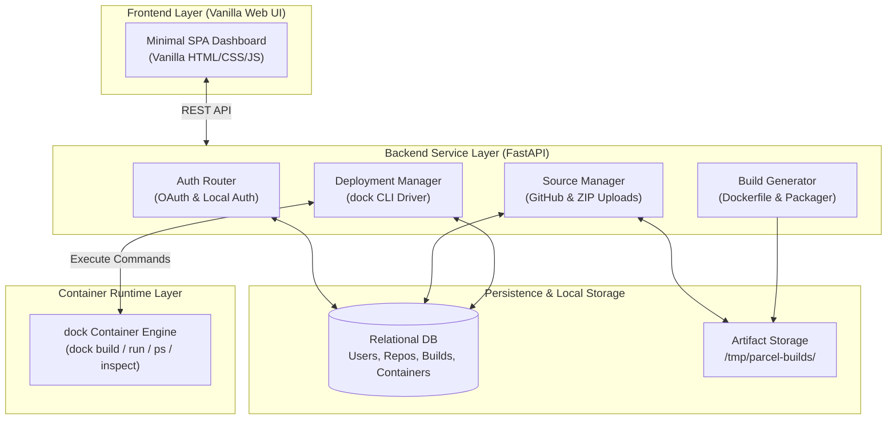

# Parcel PaaS

**Parcel PaaS** is a lightweight, developer-friendly Platform-as-a-Service (PaaS) designed to import source code (via GitHub OAuth or ZIP archives), dynamically generate build configurations, and deploy isolated application containers using a custom container runtime (`dock`).

> [!IMPORTANT]  
> **Custom Container Runtime Integration (`dock`)**  
> Parcel PaaS uses a proprietary/custom container engine called **`dock`** (e.g., `dock-minidocker`) for container management. Image builds, execution, process listing (`dock ps`), and container inspection (`dock inspect`) interface directly with `dock`.

---

## System Architecture



---

## Project Boundaries & Feature Roadmap (v1)

### 1. Authentication & User Management
- [x] **GitHub OAuth Integration**: Complete OAuth authorization code flow.
- [ ] **Multi-Provider Authentication**: Support 3 authentication mechanisms:
  - [x] GitHub OAuth
  - [ ] Google OAuth / Second OAuth Provider
  - [ ] Email & Password / Local Credentials
- [ ] **User Persistence**: Store user profiles, access tokens, and credentials in the Database.

---

### 2. Source Code Ingestion
- [x] **GitHub Repository Listing**: Fetch user repositories via GitHub API.
- [ ] **Tarball/ZIP Source Upload**: Support direct ZIP file upload for manual repository deployments.
- [ ] **Source Metadata Storage**: Persist repository, branch, commit, and source metadata in the Database.

---

### 3. Build File Generation
- [ ] **Dynamic Build Scripting**: Detect framework/language and generate appropriate `Dockerfile` or build spec.
- [ ] **Build Environment Isolation**: Download and extract source archives into dedicated workspace build directories (`/tmp/parcel-builds/`).
- [ ] **Build Status Telemetry**: Log build outputs and status updates to DB.

---

### 4. Custom Container Runtime Integration (`dock`)
- [ ] **Image Building**: Execute `dock build` using generated build specifications.
- [ ] **Container Execution**: Spawn isolated application containers with `dock run`.
- [ ] **Dashboard Monitoring (`dock ps` / `dock inspect`)**:
  - Periodically poll container statuses via `dock ps`.
  - Fetch detailed process and network metadata via `dock inspect`.
- [ ] **Container Telemetry Persistence**: Save container runtime statistics, ports, and logs in the DB for UI rendering.

---

## Repository Structure

```
.
├── backend/
│   ├── app/
│   │   ├── api/          # Route handlers (auth, source, deploy)
│   │   ├── core/         # Config, security, logging
│   │   ├── db/           # Database models, connection, session
│   │   ├── models/       # Database schemas (User, Document, Container)
│   │   ├── schemas/      # Pydantic request/response schemas
│   │   ├── services/     # GitHub API, tarball, dock engine driver
│   │   └── main.py       # FastAPI application entry point
│   ├── requirements.txt
│   └── .env
├── frontend/
│   ├── index.html        # Clean HTML5 entry point
│   ├── main.js           # Vanilla JS dashboard logic
│   ├── style.css         # Minimal dark mode styling
│   └── vite.config.ts    # Vite development proxy configuration
├── docker-compose.yml
└── README.md
```

---

## Getting Started

### 1. Backend Setup (FastAPI)

```bash
# Navigate to backend directory
cd backend

# Install Python dependencies
pip install -r requirements.txt

# Start the API server
uvicorn app.main:app --reload --port 8000
```

### 2. Frontend Setup (Vite + Vanilla JS)

```bash
# Navigate to frontend directory
cd frontend

# Install Node dependencies
npm install

# Start Vite dev server
npm run dev
```

Visit **`http://localhost:5173`** in your browser to access the dashboard!
